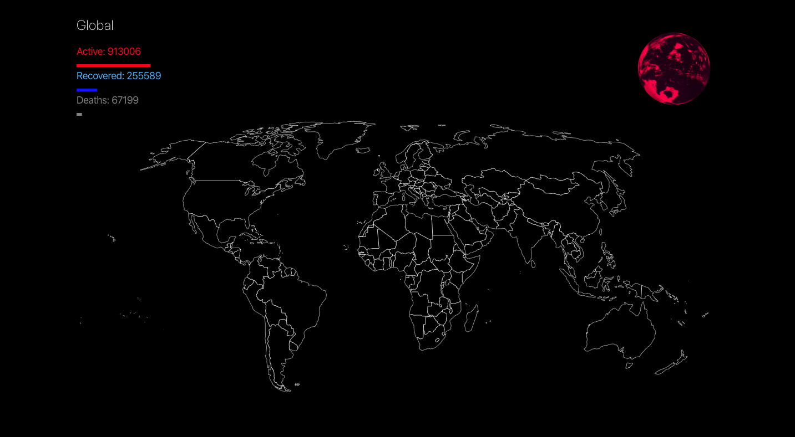

# Covid 19 - state of recovery

## A visual representation - state of recovery

This is a visual representation of the covid-19 (corona) virus epidemic state of recovery, globally and in each country separately. When a country on the map is pressed or searched for, its color is changing based on the number of confirmed cases and recovery cases. Confirmed cases are representing by the red color and recovered cases by the blue color. The colors are also reflected in the 3d-model globe.

 
This project made possible thanks to:
<a target="blank" href="https://github.com/NovelCOVID/API">
NovelCOVID/API
</a>
